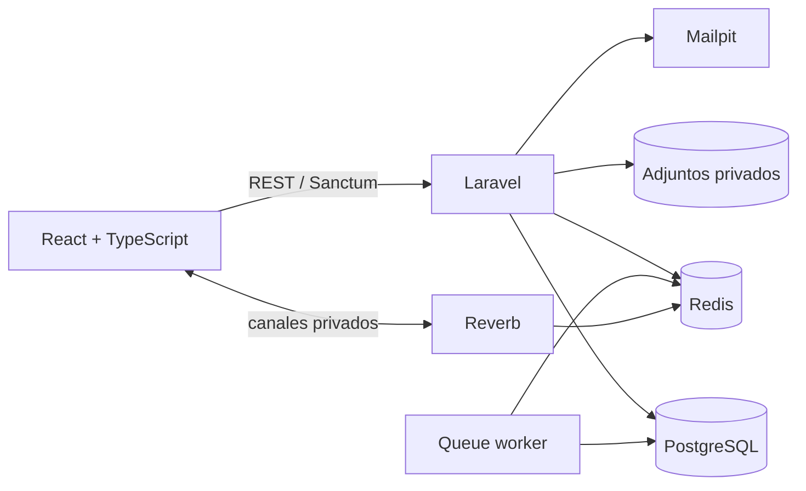

# SupportFlow

Una mesa de ayuda para equipos pequeños, construida como proyecto personal para practicar un flujo full-stack completo: desde la autorización en la API hasta los estados de carga en React.

[](#pruebas)
[](LICENSE)

## Por qué hice este proyecto

Quería salir del típico CRUD de portfolio. Un sistema de soporte parecía un buen problema porque obliga a resolver cosas que suelen quedar fuera de una demo sencilla: quién puede ver cada ticket, qué ocurre al reasignarlo, cómo distinguir una respuesta de una nota interna y de dónde salen las métricas del panel.

El caso ficticio es **Lumen Norte**, un equipo que recibe incidencias de cuenta, facturación e integraciones. Los datos de ejemplo incluyen tickets resueltos, otros fuera de SLA y carga desigual entre agentes; no intentan mostrar una operación perfecta.

## Recorrido rápido

Con `VITE_DEMO_MODE=true` se puede revisar el frontend sin levantar la API:

1. El panel resume volumen, primera respuesta, resolución y cumplimiento de SLA.
2. La bandeja permite buscar, filtrar por estado y exportar el resultado a CSV.
3. Cada ticket muestra conversación, notas internas, asignación y tiempo restante del SLA.
4. El formulario de alta incluye categoría, prioridad, descripción y adjuntos.
5. La base de conocimiento separa guías operativas y documentación administrativa.

El modo conectado usa la API Laravel y autenticación mediante Sanctum.

## Decisiones que tomé

| Decisión | Motivo | Coste o límite |
|---|---|---|
| `organization_id` en las entidades del dominio | El aislamiento no depende de filtros del frontend | Todas las consultas sensibles deben aplicar el ámbito de organización |
| Políticas Laravel para tickets y adjuntos | Centralizar la autorización y poder probarla | Hay que mantener las políticas al añadir acciones nuevas |
| Notas internas en la misma conversación | Conservan el orden cronológico del ticket | La API debe retirarlas explícitamente para solicitantes |
| Fechas de primera respuesta y resolución persistidas | El panel calcula métricas sobre hechos, no sobre valores simulados | Los cambios de estado deben actualizarse de forma transaccional |
| Redis para colas y caché; Reverb para eventos | Separar trabajo asíncrono y actualizaciones en tiempo real | Añade servicios que no compensarían en una aplicación muy pequeña |
| Un modo demo en el frontend | Permite revisar la interfaz sin Docker | No sustituye una prueba end-to-end contra la API |

La autoasignación actual usa una estrategia sencilla: el agente activo con menos tickets abiertos. No pretende ser un motor de reglas; es un punto de partida fácil de explicar y probar.

## Arquitectura

```mermaid
erDiagram
    ORGANIZATION ||--o{ USER : contiene
    USER }o--o{ ROLE : tiene
    ORGANIZATION ||--o{ TEAM : organiza
    TEAM }o--o{ USER : agrupa
    ORGANIZATION ||--o{ TICKET : aisla
    USER ||--o{ TICKET : solicita
    USER o|--o{ TICKET : atiende
    TICKET ||--o{ TICKET_COMMENT : conversa
    TICKET ||--o{ ATTACHMENT : adjunta
    TICKET ||--o{ TICKET_ASSIGNMENT : registra
    TICKET ||--o{ AUDIT_EVENT : audita
    PRIORITY ||--o{ SLA_RULE : define
```





## Tecnologías

- **Frontend:** React 19, TypeScript, Vite, Tailwind CSS, TanStack Query y Recharts.
- **Backend:** PHP 8.3, Laravel 12, Sanctum y Reverb.
- **Datos:** PostgreSQL 17 y Redis 7.
- **Pruebas:** Vitest, Testing Library y Pest.
- **Entorno:** Docker Compose, Nginx, Mailpit y GitHub Actions.

## Puesta en marcha

Se necesita Docker Desktop con Compose v2 y PowerShell 7.

```powershell
git clone https://github.com/Hut0Xx/SupportFlow.git
cd SupportFlow
Copy-Item .env.example .env
Copy-Item backend/.env.example backend/.env
Copy-Item frontend/.env.example frontend/.env
./scripts/setup.ps1
```

El script genera la clave de Laravel, ejecuta las migraciones y seeders y arranca:

| Servicio | URL |
|---|---|
| Frontend | <http://localhost:5173> |
| API | <http://localhost:8000/api/v1> |
| Health check | <http://localhost:8000/up> |
| Mailpit | <http://localhost:8025> |
| Reverb | `ws://localhost:8080` |

### Solo frontend

```powershell
pnpm install
Copy-Item frontend/.env.example frontend/.env
# Cambiar VITE_DEMO_MODE a true
pnpm dev
```

## Cuentas de desarrollo

La contraseña se toma de `DEMO_PASSWORD`. El valor del archivo de ejemplo es únicamente local.

| Rol | Correo |
|---|---|
| Solicitante | `solicitante@supportflow.local` |
| Agente | `agente@supportflow.local` |
| Administrador | `admin@supportflow.local` |

## API

El contrato completo está en [`docs/openapi.yaml`](docs/openapi.yaml). Algunas rutas relevantes:

```text
POST   /api/v1/auth/login
GET    /api/v1/dashboard
GET    /api/v1/tickets
POST   /api/v1/tickets
POST   /api/v1/tickets/{id}/comments
POST   /api/v1/tickets/{id}/assign
POST   /api/v1/tickets/{id}/resolve
POST   /api/v1/tickets/{id}/close
GET    /api/v1/attachments/{id}/download
```

La descarga de un adjunto vuelve a comprobar la política del ticket; conocer una URL no da acceso al archivo. Las notas internas tampoco se serializan para un solicitante.

## Pruebas

```powershell
./scripts/check.ps1
```

O por separado:

```powershell
pnpm lint
pnpm test
pnpm build
docker compose run --rm api ./vendor/bin/pint --test
docker compose run --rm -e DB_DATABASE=supportflow_test api php artisan test
```

Las pruebas backend cubren, entre otros casos, que un solicitante no vea tickets ajenos, que un agente no pueda borrar tickets, que un ticket necesite resolución antes de cerrarse y que los cambios de estado dejen auditoría.

## Estado real del proyecto

En el entorno donde desarrollé esta versión pude ejecutar el lint, las pruebas de interfaz y el build de producción. Los tests de Laravel están escritos, pero no pude ejecutarlos allí porque no había PHP ni Docker instalados; la CI los ejecuta en un runner con PostgreSQL.

Lo siguiente que haría sería:

- completar el CRUD de artículos de conocimiento;
- añadir una prueba end-to-end del flujo crear → asignar → responder → resolver;
- mover adjuntos a un bucket S3 privado con URLs temporales;
- sustituir el token guardado en `localStorage` por el flujo SPA con cookie `HttpOnly` de Sanctum.

He dejado estos límites por escrito porque forman parte de las decisiones del proyecto, no porque sean características terminadas.

## Estructura

```text
backend/          API, políticas, servicios, migraciones y pruebas
frontend/src/     páginas, componentes, acceso a datos y pruebas
docs/             contrato OpenAPI
scripts/          instalación y comprobaciones locales
.github/          integración continua
```

## Autor

Hecho por **Hugo Coarasa Oliva** como proyecto de portfolio full-stack.

[MIT](LICENSE)
