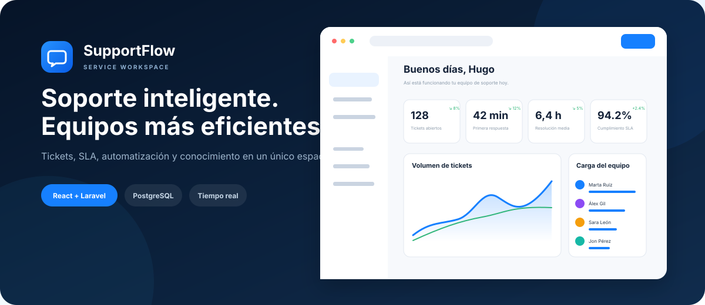
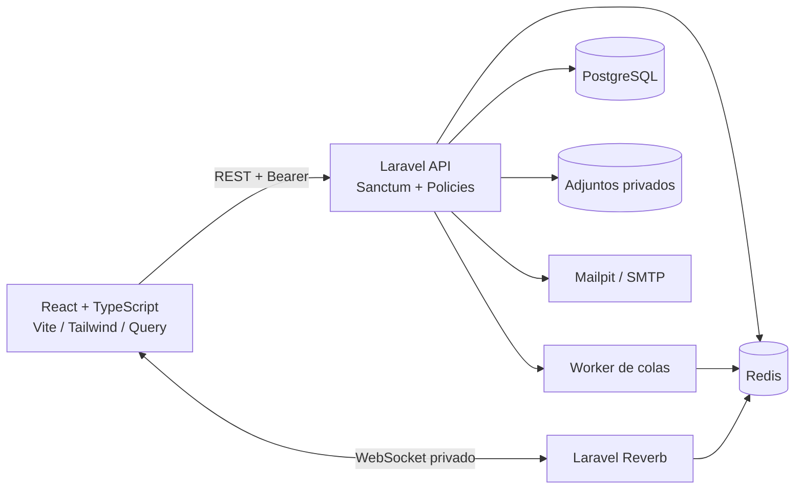
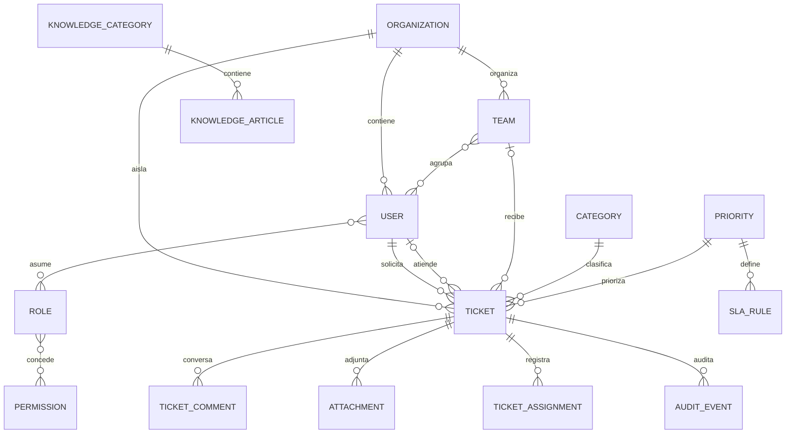

<p align="center">
  
</p>

<p align="center">
  <strong>Gestión de soporte técnico con SLA, automatización, auditoría y tiempo real.</strong>
</p>

<p align="center">
  
  
  
  
  
  
</p>

# SupportFlow

Plataforma SaaS de gestión de incidencias y soporte técnico construida como proyecto de portfolio por **Hugo Coarasa Oliva**. SupportFlow reúne tickets, conversaciones, asignaciones, acuerdos de nivel de servicio, auditoría, conocimiento y métricas en una experiencia responsive orientada a equipos profesionales.

Este repositorio demuestra una arquitectura full-stack moderna: dominio multiempresa, autorización en servidor, métricas derivadas de datos reales, infraestructura reproducible y una interfaz cuidada para operaciones de soporte.

## Qué incluye

- Panel ejecutivo con tickets por estado, primera respuesta, resolución, cumplimiento de SLA y carga del equipo.
- Bandeja con búsqueda y filtros, vista detallada, respuestas públicas y notas internas.
- Ciclo de estados `nuevo → abierto → pendiente → resuelto → cerrado`; cerrar exige una resolución.
- Asignación manual a agente/equipo y base preparada para reglas de autoasignación.
- Autenticación por Laravel Sanctum, recuperación de contraseña y rate limiting.
- Roles solicitante, agente y administrador aplicados mediante políticas del backend.
- Aislamiento por organización: un solicitante solo ve sus tickets y el resto de perfiles queda limitado a su organización.
- SLA por prioridad, detección de incumplimiento y métricas calculadas desde PostgreSQL.
- Auditoría inmutable de creación, edición, comentarios, asignación, resolución, cierre y borrado.
- Canal privado de Laravel Reverb para cambios en tickets y organizaciones.
- Adjuntos privados modelados con metadatos, hash y límites de tipo/tamaño.
- Exportación CSV, base de conocimiento, datos demo y correo local con Mailpit.
- Interfaz en español, navegación por teclado, estados de carga/vacíos/error y tema claro/oscuro persistente.
- Contrato [OpenAPI 3.1](docs/openapi.yaml), CI, Docker Compose y licencia MIT.

## Vista del producto

La interfaz se ha revisado en navegador en sus vistas principales: inicio de sesión, panel ejecutivo y bandeja de tickets. La carpeta `docs/screenshots` queda reservada para capturas rasterizadas de una instancia Docker completa.

| Panel ejecutivo | Operación diaria |
|---|---|
| Métricas de volumen, tiempos de respuesta, resolución y SLA | Búsqueda, filtros, prioridades, estados y asignación |
| Gráficos de tendencia y carga por agente | Conversación pública, notas internas y auditoría |

## Arquitectura





## Stack

| Área | Tecnología |
|---|---|
| Frontend | React 19, TypeScript, Vite, Tailwind CSS 4, TanStack Query, Recharts |
| Backend | PHP 8.3, Laravel 12, Sanctum, Reverb |
| Datos | PostgreSQL 17, Redis 7 |
| Calidad | ESLint, TypeScript, Vitest, Testing Library, Pest, Pint |
| Operación | Docker Compose, Nginx, Mailpit, GitHub Actions |

## Inicio rápido con Docker

Requisitos: Docker Desktop con Compose v2 y PowerShell 7.

```powershell
git clone <url-del-repositorio> SupportFlow
cd SupportFlow
Copy-Item .env.example .env
Copy-Item backend/.env.example backend/.env
Copy-Item frontend/.env.example frontend/.env
./scripts/setup.ps1
```

El script construye las imágenes, genera `APP_KEY`, migra, carga datos de demostración e inicia todos los servicios:

- Aplicación: <http://localhost:5173>
- API: <http://localhost:8000/api/v1>
- Salud: <http://localhost:8000/up>
- Reverb: `ws://localhost:8080`
- Mailpit: <http://localhost:8025>

Comandos manuales equivalentes:

```powershell
docker compose build
docker compose up -d postgres redis mailpit
docker compose run --rm api php artisan key:generate
docker compose run --rm api php artisan migrate --seed
docker compose up -d
```

## Desarrollo del frontend

```powershell
pnpm install
pnpm dev
```

Para navegar por la interfaz sin backend, establece `VITE_DEMO_MODE=true` en `frontend/.env`. En modo conectado se usa `VITE_API_URL` y el token Sanctum se almacena localmente para esta demo de portfolio.

## Cuentas demo

La contraseña procede de `DEMO_PASSWORD`; el valor de ejemplo solo es válido para desarrollo.

| Rol | Correo | Contraseña de ejemplo |
|---|---|---|
| Solicitante | `solicitante@supportflow.local` | `SupportFlow2026!` |
| Agente | `agente@supportflow.local` | `SupportFlow2026!` |
| Administrador | `admin@supportflow.local` | `SupportFlow2026!` |

No reutilices estas credenciales ni los secretos de los `.env.example` en producción.

## API

El contrato está en [docs/openapi.yaml](docs/openapi.yaml) y puede abrirse en Swagger Editor, Redocly o cualquier visor OpenAPI 3.1. Rutas principales:

```text
POST   /api/v1/auth/login
POST   /api/v1/auth/logout
GET    /api/v1/me
GET    /api/v1/dashboard
GET    /api/v1/tickets
POST   /api/v1/tickets
GET    /api/v1/tickets/{id}
PATCH  /api/v1/tickets/{id}
POST   /api/v1/tickets/{id}/comments
POST   /api/v1/tickets/{id}/assign
POST   /api/v1/tickets/{id}/resolve
POST   /api/v1/tickets/{id}/close
GET    /api/v1/tickets/export
```

## Pruebas y calidad

Todo el repositorio:

```powershell
./scripts/check.ps1
```

Por separado:

```powershell
pnpm lint
pnpm test
pnpm build
docker compose run --rm api ./vendor/bin/pint --test
docker compose run --rm -e DB_DATABASE=supportflow_test api php artisan test
```

Las pruebas backend documentan los criterios críticos: privacidad entre solicitantes, bloqueo de administración para agentes, resolución obligatoria al cerrar y creación de auditoría.

## Seguridad

- Autorización en políticas Laravel y consultas acotadas por `organization_id`.
- Rate limits diferenciados para autenticación y API.
- Validación de relaciones contra la organización del usuario.
- Notas internas omitidas para solicitantes.
- Adjuntos en disco privado; no se publican rutas físicas.
- CORS restringido al origen configurado, cookies seguras compatibles con Sanctum y canales Reverb privados.
- Secretos solo mediante variables de entorno; los valores del repositorio son ejemplos de desarrollo.

Para producción: usa un gestor de secretos, TLS extremo a extremo, almacenamiento S3 privado con URLs temporales, worker supervisado, backups cifrados de PostgreSQL, observabilidad y rotación de claves.

## Estructura

```text
SupportFlow/
├── backend/                 # Laravel: API, dominio, políticas, migraciones y tests
│   ├── app/
│   ├── database/
│   ├── routes/
│   └── tests/
├── frontend/                # React, páginas, componentes y pruebas
│   └── src/
├── docs/
│   ├── openapi.yaml
│   └── screenshots/
├── scripts/                 # Puesta en marcha y verificación
├── .github/workflows/ci.yml
└── docker-compose.yml
```

## Verificación y limitaciones

Verificado en el entorno de construcción:

- `pnpm lint`: correcto.
- `pnpm test`: 2 pruebas de interfaz superadas.
- `pnpm build`: compilación TypeScript y bundle Vite correctos.

No verificado en este host porque no dispone de PHP, Composer ni Docker:

- instalación de dependencias PHP;
- migraciones/seeders PostgreSQL;
- pruebas Pest y formato Pint;
- arranque conjunto de Compose, Redis, Reverb y Mailpit.

La CI y `scripts/check.ps1` ejecutan esas comprobaciones donde Docker/PHP estén disponibles. La interfaz incluye módulos principales funcionales; las pantallas secundarias de Equipo, Informes y Administración son puntos de integración visibles, y la autoasignación avanzada, gestión CRUD completa de conocimiento y flujo real de adjuntos requieren iteraciones posteriores.

## Autor

**Hugo Coarasa Oliva** — desarrollador web full-stack junior.

Distribuido bajo la [licencia MIT](LICENSE).

